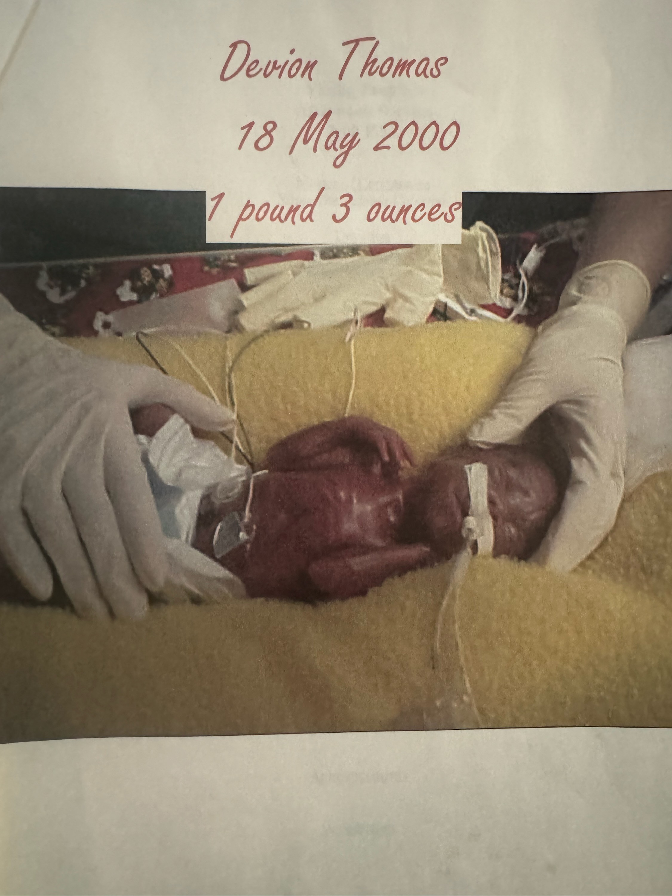

<!DOCTYPE html>
<html lang="en">
    <head>
        <meta charset="UTF-8">
        <meta name="viewport" content="width=device-width",  inital-scale=1.0> 
        <title>My Portfolio</title>
        <!-- Bootstrap Css-->
         <link href="https://stackpath.bootstrapcdn.com/bootstrap/4.5.2/css/bootstrap.min.css" rel="stylesheet">
         <link href="portfolio.css" rel="stylesheet"> 
         
    </head>
    <body>
        <!-- Header with Image and Quote -->
        <header class="text-center mt-4">
            

                

                     
                <h2 class="fade-in">
                    <blockquote class="blockquote">
                        
Your Future is Created by what you do Today not tomorrow! 
                            -Mr.Amazing
                        

                    </blockquote> 
                </h2>
                

            

        </header>

        <!-- Navigation Bar -->
         <nav class="navbar navbar-expand-lg  navbar-light bg-light">
            <a class="navbar-brand" href="#">My Portfolio</a>
            <button class="navbar-toggler" type="button" data-toggle="collapse" data-target="#navbarNav" aria-controls="navbarNav"
            aria-expanded="false" aria-label="Toggle Navigation">
            
        </button>
        

            <ul class="navbar-nav">
                <li class="nav-item">
                    <a class="nav-link" href="#">Home</a>
                </li>
                <li class="navbar-item">
                    <a class="nav-link" href="about.html">About</a>
                </li>
                <li class="navbar-item">
                    <a class="nav-link" href="contact.html">Booking</a>
                </li> 
                <li class="navbar-item">
                    <a class="nav-link" href="skills.html">Skills</a>
                </li>
            </ul> 
           
        

         </nav> 

         <!-- Introduction Section-->
          

            <h2> Welcome to my Portfolio</h2>
            
 
                This journey has been outstanding to go through, 
                I became passionate about coding thru learning different languages. 
                Coding is like poetry, every line tells a story, 
                shows the art in what the world gets to experience. 
                It's thrilling to be a part of that story, to feel the excitement and energy of coding.
                 Welcome to my Portfilo, where you'll see the personal growth and learning that has inspired and motivated me. 

          
 

          <!-- Hero Section -->
            <section class="Hero d-flex align-items-center text-center"> 
                

                <h1 class="display-4 neon-text">Hi, I'm Devion</h1>
                    
A Passionate Web Developer | Photographer | Freelancer | Intelligent  

                    <a href="skills.html" class="btn btn-neon btn-lg">View My Work </a>
                

          

    </body>
</html>   

<!-- about html ---> 

<!DOCTYPE html>
<html lang="en">
    <head>
        <meta charset="UTF-8">
        <meta name="viewport" content="width=device-width",  inital-scale=1.0> 
        <title>My Portfolio</title>
        <!-- Bootstrap Css-->
         <link href="https://stackpath.bootstrapcdn.com/bootstrap/4.5.2/css/bootstrap.min.css" rel="stylesheet">
         <link href="portfolio.css" rel="stylesheet"> 
         
    </head>
    <body>
        <!-- Header with Image and Quote -->
        <header class="text-center mt-4">
            

                

                     
                <h2 class="fade-in">
                    <blockquote class="blockquote">
                        
Your Future is Created by what you do Today not tomorrow! 
                            -Mr.Amazing
                        

                    </blockquote> 
                </h2>
                

            

        </header>
 <!-- Navigation Bar -->
 <nav class="navbar navbar-expand-lg  navbar-light bg-light">
    <a class="navbar-brand" href="#">My Portfolio</a>
    <button class="navbar-toggler" type="button" data-toggle="collapse" data-target="#navbarNav" aria-controls="navbarNav"
    aria-expanded="false" aria-label="Toggle Navigation">
    
</button>

    <ul class="navbar-nav">
        <li class="nav-item">
            <a class="nav-link" href="portfolio.html">Home</a>
        </li>
        <li class="navbar-item">
            <a class="nav-link" href="#">About</a>
        </li>
        <li class="navbar-item">
            <a class="nav-link" href="contact.html">Booking</a>
        </li>
        <li class="navbar-item">
            <a class="nav-link" href="skills.html">Skills</a>
        </li>
    </ul>

 </nav>  

<!-- Swipe Card Structure -->

 
    

        <!-- Card 1: Future Path with Robotics  -->
         

            
 
                

                     
                    

                        <h5 class="card-title">My Future in Robotics</h5>
                        
I've always been passionate about Robotics and how they can accomplish things humans cannot. My goal is to create innovative technology available to everyone. Not just the 
                            ones who can afford it. 
                        

                    

                

            

         

<!-- Card 2: Hobbies Overview & Personal -->
        

            

                

                     
                    

                    <h5 class="card-title">Where it all Started</h5>
                    
I was born three months early, weighing only 1 pound and 3 ounces. 
                        My start in life was very dangerous; doctors said I might not survive. 
                        Each day was a struggle as I fought for my life in the hospital. 
                        Now, at 24 years old, I look back on my journey. I live with diabetes, 
                        which brings challenges, but I appreciate every day of life. 
                        My early struggles helped me grow stronger and taught me to value every moment.

                    

                

            

        

            <!-- Card 3: Hobbies -->
            

                

                    

                         
                        

                            <h5 class="card-title">Photography</h5>
                            
Aside from Tech, I'm into Nature & Photographer I've always had a ken eye on the magnificent!

                        

                    

                

            

        

    <!-- Left & Right Navigation Arrows -->
     <button class="carousel-control-prev" type="button" data-bs-target="#cardCarousel" data-bs-slide="prev">
        
     </button>
     <button class="carousel-control-next" type="button" data-bs-target="#cardCarousel" data-bs-slide="next">
        
     </button>

<!-- BootStrap & JS-->
 
  

</body>
</html> 

<!-- Booking Form ---> 
 Form -->
          <form id="bookingForm" class="p-4 border rounded bg-light">
            <h2 class="text-center mb-4">Book an Appointment</h2>
            <!-- First Name-->

            

                <label for="firstName" class="form-label">First Name</label>
                    <input type="text" class="form-control" id="firstName" name="firstName" required>
            

<!-- Last Name -->

            

                <label for="lastName" class="form-label">Last Name</label>
                <input type="text" class="form-control" id="lastName" name="lastName" required>
            

            <!--Email -->

            

                <label for="email" class="form-label">Email</label>
                <input type="email" class="form-control" id="email" name="email" required>
                
PLease enter a valid email address

            

            <!-- Phone Number -->

            

                <label for="phone" class="form-label">Phone Number</label>
                <input type="tel" class="form-control" id="phone" name="phone"  required>

                
Please Enter a valid 10-digit phone number

            

            

                <label for="date" class="form-label">Select Date</label>
                <input type="date" class="form-control" id="date" name="date" required>
            

            

                <label for="time" class="form-label">Select Time</label>
                <input type="time" class="form-control" id="time" name="time" required>
            

            <button type="submit" class="btn btn-primary w-100">Book NOW</button>
          </form>

          

            Booking Confirmed! 
          
 

          <!-- portfolio css ---> 
          @keyframes fadeIn{
    from { opacity: 0;}
    to { opacity: 2;}
}

.fade-in{
    animation: fadeIn 5s ease-in-out; 
}

/* Fade-in from the bottom animation */ 
@keyframes fadeInBottom{
    from{
        opacity: 0;
        transform: translateY(50px);
    } 
    to {
        opacity: 1;
        transform: translateY(1);
    }
}

/* Styling for skill containers */ 
.skill-box{
    border: 2px solid black; /* Black Border */ 
    padding: 20px;
    border-radius: 10px; /* Rounded corners */ 
    background-color: white; /* Background color*/ 
    text-align: center;
    transition: 0.6s; /*SMooth hover effect */ 
    /* Applys the Animation */ 
    opacity: 0; /* starts hidden */ 
    animation: fadeInBottom 1.6s ease-in-out forwards;
}

/* Delay animations for each column*/ 
.skill-box:nth-child(1) { animation-delay: 0.2s;}
.skill-box:nth-child(2) { animation-delay: 0.4s;}
.skill-box:nth-child(3) { animation-delay: 0.5s;} 

/*Contact(Booking Form) */ 
#bookingForm{
    max-width: 500px;
    margin: auto;
    box-shadow: 1px 1px 10px rgba(0, 0, 2, 0.1);
} 

#bookingForm h2{
    color: #007bff;
}
.btn-primary{
    background-color: #007bff;
    border: none;
}

.btn-primary:hover{
    background-color: #0056b3;
}

/* Hero section ( About Page ) */ 
.hero {
    height: 100vh;
    background: url() center/cover no-repeat; 
    color: whitesmoke;
    display: flex;
    align-items: center;
    justify-content: center;
    text-align: center;
}

/* Neon Glow for Specific Text */ 
.neon-text {
    color: #0ff;
    text-shadow: 0 0 10px #0ff 0 0 20px #0ff, 0 0 30px #0ff;
}
/* Neon Cursor Animation */ 
.cursor{
    display: inline-block;
    width: 5px;
    background-color: #0ff;
    animation: blink 0.8s infinite;
}
@keyframes blink{
    50%{ opacity: 0; }
}

/* Floating effect for smooth animation */ 
@keyframes float{
    0%{transform: translateY(0px);} 
    50% {transform: translateY(-10px);}
    100% {transform: translateY(0px); }
}

.hero .continer {
    max-width: 800px;
    animation: float 4s ease-in-out infinite;
}

/* Neon Button*/ 
.btn-neon{
    color: white;
    font-size: 1.2rem;
    background-color: transparent;
    border: 2px solid#0ff;
    box-shadow: 0 0 5px #0ff, 0 0 10px #0ff, 0 0 15px #0ff; 
    transition: 0.4s ease-in-out;
}
.btn-neon:hover {
    background-color: #0ff;
    color: #000; 
    box-shadow: 0 0 20px #0ff, 0 0 30px #0ff, 0 0 40px #0ff;
}

/* Pulsating Background Glow */ 
@keyframes neon-glow{
    0% {box-shadow: 0 0 10px #0ff;} 
    50% { box-shadow: 0 0 30px #0ff;}
    100% {box-shadow: 0 0 10px #0ff;}
}

.btn-success {
    background-color: #0076ff;
    border: none;
}

.btn-success:hover{
    background-color: #0056b3;
}

/* Center the Carousel */ 
#cardCarousel{
    width: 80%;
    margin: auto;
}

/* style cards */ 
.card {
    border-radius: 10px;
    box-shadow: 0 4px 8px rgba(0, 0, 0, 0.2);
    transition: transform 0.3s ease-in-out;
}
.card:hover {
    transform: scale(1.05);
}
/*Carousel Controls */ 
.carousel-control-prev-icon,
.carousel-control-next-icon{
    background-color: rgba(0, 0, 0, 0.5);
    border-radius: 50%;
    padding: 10px;
}

/*Carousel Transition */ 
.carousel-inner{
    display: flex;
    align-items: center;
}

/* Ensure images fit well */ 
.card-img-top{
    height: 200px;
    object-fit: cover;
}

/* smooth scroll */ 
html{
    scroll-behavior: smooth;
}

/*Card Hover Effect */ 
.card{
    transition: transform 0.3s ease-in-out, box-shadow 0.3s ease-in-out;
}
.card:hover{
    transform: translateY(-5px);
    box-shadow: 0 8px 20px rgba(0, 0, 0, 0.2);
}

/* Parallax Header */ 
.hero{
    background-attachment: fixed;
    background-size: cover;
}
